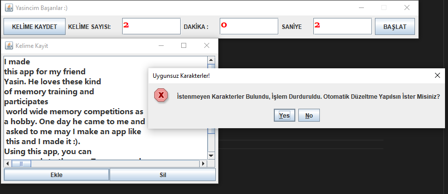
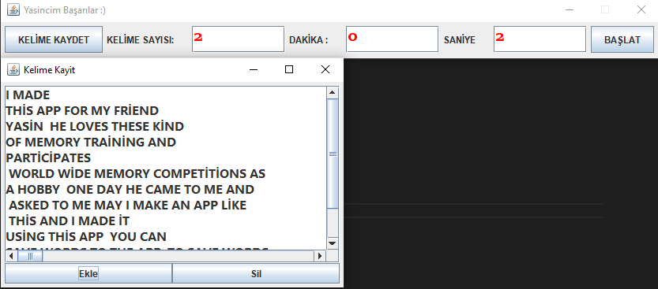
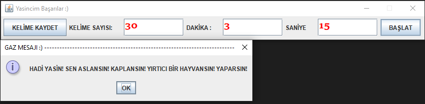
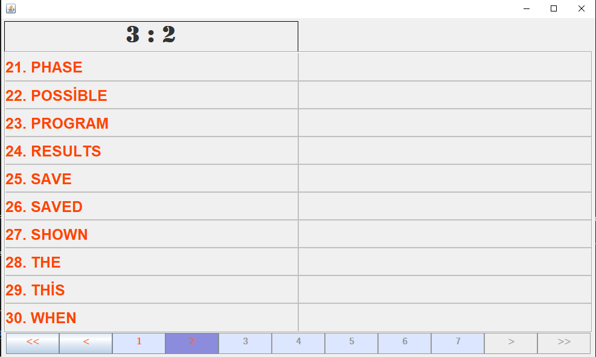
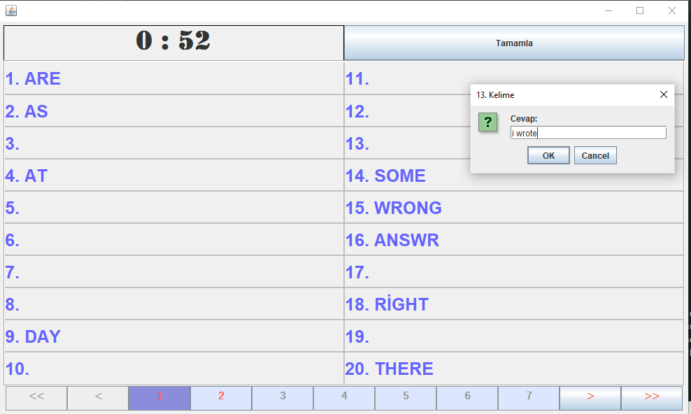
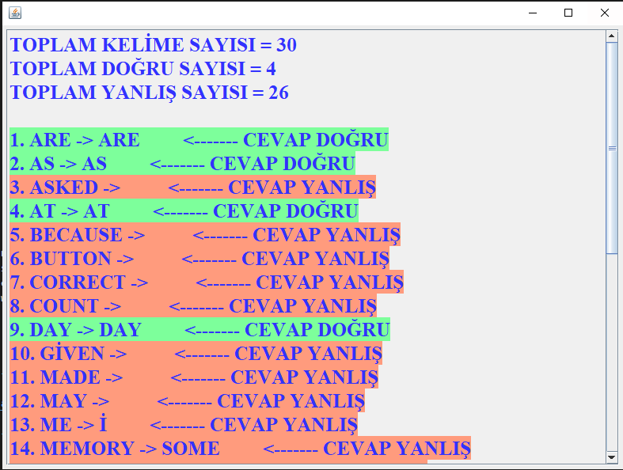

### Project Information
--- 
* Project Name:  
Word Memorization
 

* Project Team:  
Fadıl Şahin
 

* Project Date:  
June 2019
 

* Project State And Duration:  
Done, 2 days
 

* Project Description:  
I made this app for my friend Yasin. He loves these kind of memory training and participates world wide memory competitions as a hobby. One day he came to me and asked to me may I make an app like this and I made it :). Using this app, you can save words to the app. To save words it is enough to copy and paste any text without looking its structure. Because the program can make it appropriate itself. After saved words, a time interval and word count is given to the app and is clicked start. When memorizing phase is started, you try to memorize words.  Words are shown as pages if it is not possible to fit in ui size. After this phase,when clock comes to the 0, there is testing phase that you write words to its appropriate number and at the and finish button is clicked. After that, Results which are correct or not words is shown to you. Sadly I lost code files but bin files there was.
 
 

:exclamation: --------------------------------------------------------------------------------- :exclamation:

- ***Executable jar is in [root](KelimeEzber.jar) folder***

:exclamation: --------------------------------------------------------------------------------- :exclamation:

### Screenshots
---

### Adding Words To The App

### Program Makes Corrections Because Of ': )' Characters

### Starting Training

### Memorizing Phase

### Testing Phase

### Result Page

